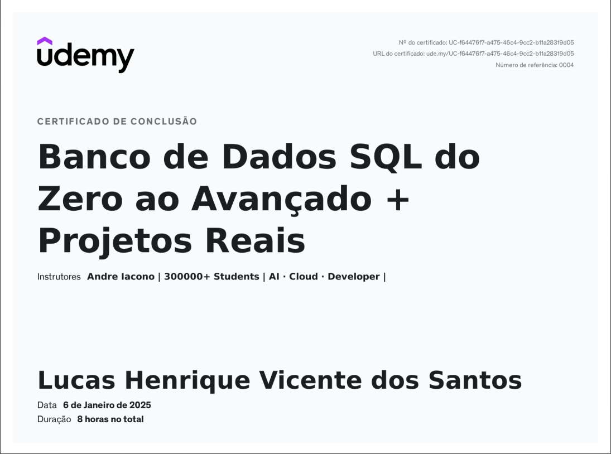
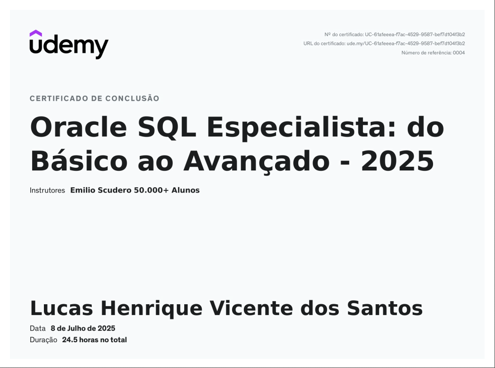
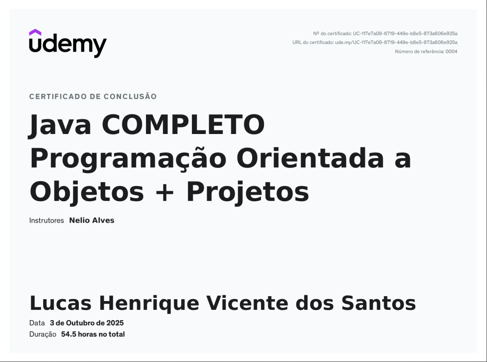

**System.out.println("Hello World! Me chamo Lucas Henrique Vicente dos Santos! 😄");**

- 🏫Curso: Análise e Desenvolvimento de Sistemas.
- 💻 Linguagens: Java, C# e JavaScript.
- 👾 Banco de dados: MySQL e Oracle SQL.
- 🛠️ Ferramentas: Git, GitHub, Visual Studio Code, IntelliJ IDEA e Visual Studio.
- 🧠 Focado em: Full-Stack developer.

  

### 🏅 Certificados

### 👨‍💻 Tecnologias que eu Utilizo

 
  
  
  
  
  
  
  

##

  
  

